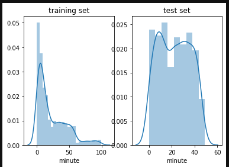
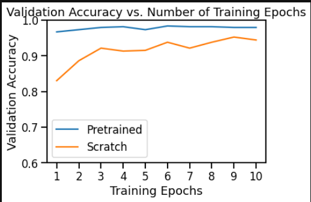
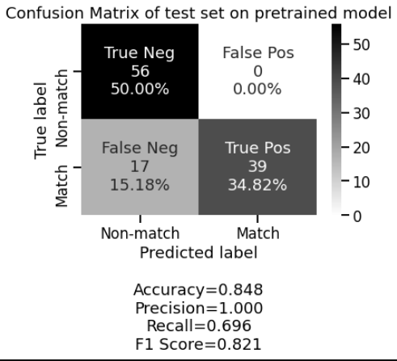
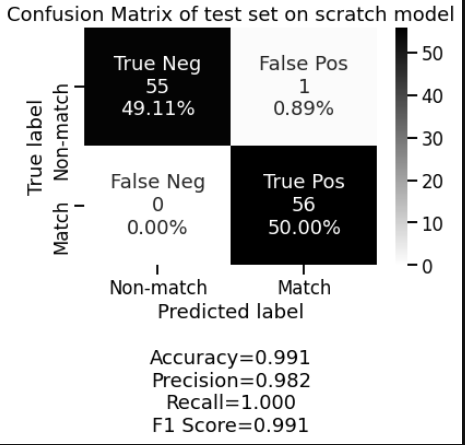

# respo.vision

ReSpo.Vision recruitment task - Deep Learning

## [results csv](results/from_scratch.csv)
## [main notebook](main.ipynb)

# step 1: Data inspection and processing

The dataset consisted of images/frames taken from 25 different matches. The goal of this exercise was to build a model which could differentiate between a **match** frame (pos) and a **non-match** frame (neg).

The training set from 3 files (tournaments/leagues) consisted of a total of 

* 1335 non-match frames
* 1643 match frames

Hence forming a rather balanced dataset. 

In order to ensure that the model does not overfit and is able to generelize the following aspects were taken into consideration:

	1. Frames from the same match should not exist in both the training and validation datasets
 	2. Ensure that the splitting does not produce an imbalanced dataset

An initial data exploration found that most of the frames come from the beggining of the match where as in the test set they seem to only come only from the first half of the game.

To perform the train/val split a combinatorics approach was applied to find the best possible divisions of unique matches into both datasets while ensuring:

* a) overall class balance (neg, pos) summing all matches 

* b) instance balance as desired by the train val split

This approach is feasible due to the number of matches being a low 25, as it has n! Complexity

In the end we had the following split

	* train: 15 matches
	* Val: 8 matches
	* Test: 2 matches

# step 2: Model selection

An initial thought seeing this was an object classification problem was to explore the dataset to see if the current one matches any of the widely used for benchmarking. Of course, one can take the best performing model from https://paperswithcode.com/task/image-classification and apply it however, the number of parameters must be taken into account as well as implementation time (code availability/framework/ease of use on a small model). However, due to the nature of the task, I deciced to use an in built InceptionV3 network which was already implemented in Pytorch. Inception has been trained on ImageNet which may include images and learned convolutional networks which will ease our classification problem. It was the SOTA in 2016 and has a relatively small number of parameters so can also be easily trained from scratch.

# step 3: Training

Prior to training, data augmentation was employed to add noise and variaty to the training set, however, only a few oprations were appropriate such as:

* horizontal flip: in case the user (test set) views mirror images of football videos
* RandomGrayscale, ColorJitter in case the video stream in the test set has noise and is of different quality. Also, to ensure that model does not simply learn the green color of the playing field.

Training was performed using the following hyperparemeters and optimizers:

	* SGD optimizer with a LR of 0.001
	* batch_size: 30
	* 10 epochs

As the plot above shows, the pre-trained model tends to perform better right from the get go due to its weight initalisation beig on Imagenet whereas when training from scratch it takes time to converge to a good validaiton accuracy.

# Step 4: Model evaluation

The validation loss and accuracy was computed at each epoch. Due to the balanced nature of the dataset accuracy is a good metric but a confusion matrix always comes in handy in binary classificaiton.

As we can see from the two confusion matrices above, is that indeed it is the model trained from scratch that performs better on our test set. This performance is what shall be used to evaluate the secret test set.

# Conslusions

To conclude, the key aspects of solving this problem consisted of the correct test splitting, model selection, and metric evaluation. First of all, the test splitting as mentioned above ensured the model's ability to generelize and not overfit. The model selection was done on basis of performance on benchmarks, easy of use, and general feasibility of training in terms transfer learning and the number of parameters. This model can serve as a good baseline for building more advanced SOTA models in production.

